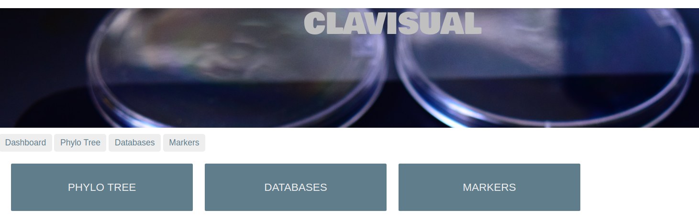
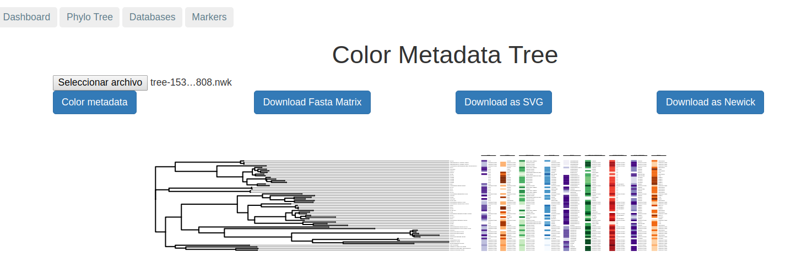
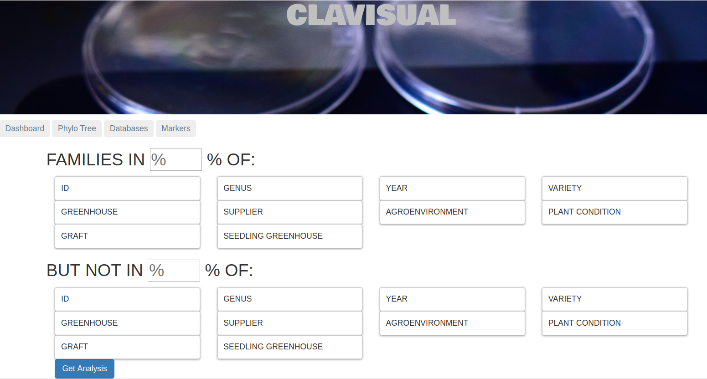

# Clavigenomics

Clavigenomics es el repositorio del backend de la aplicación de genómica bacteriana comparativa Clavisual.  
  

Clavigenomics está empacado en un contenedor de docker y a través de Clavisual provee las siguientes funcionalidades:    
-Calculo de genes comunes en bacterias relacionadas al tomate.  
-Visualizacin de árboles filogenéticos con metadatos.  
-Cálculo de marcadores de gruops selectos de bacterias relacionadas al tomate.  
  
Aquí se muestra un ejemplo de reconstrucción filogenética visualizada con metadatos y construida con la matriz de genes conservados.  
  

Esta es la interfaz de usuario para el cálculo de grupos de genes marcadores.  
  

## Funcionamiento en clavisual   
A partir de la sección 3 de este documento todos los archivos de IDs contienen solo el RAST genome id:  
> 6666666.1298689  
> 6666666.1298474  
  
El archivo de Ids sección 1:descargar genomas de RAST y precalcular blast necesita tambien el job id, por requerimiento de myrast.  
Ejemplo   
> 876438     6666666.138469  
> 358438     2.1140  
  
Usuarios, por favor, tengan cuidado de escribir los últimos ceros, 2.1140 en lugar de 2.114 como a veces los trata excel.  
   
  
### 1 Correr la imagen de docker de modo interactivo  
`docker run -i -t -v $(pwd):/usr/src/CLAVIGENOMICS nselem/clavigenomic /bin/bash`

### 2. Introducir un nuevo genoma a la aplicación  
2.1 Descargar txt faa fna   
`docker run -i -t -v $(pwd):/home nselem/myrast getFiles.pl <NewIdsFile> <user> <password>`  
NewIdsFile
> 876438     6666666.138469  
> 358438     2.1140  
Output *txt *faa *fna  
  
2.2. Crear Central  (Pseudocore files)  
`docker run -i -t -v $(pwd):/usr/src/CLAVIGENOMICS nselem/clavigenomic BBH.pl 558ParaCORE <NewIdsFile>`  
Output *Central
Note: 558ParaCORE is located in /root/clavigenomics/Pseudocore/558ParaCORE     
  
2.3. Crear blast     (Contra todos los genomas)  
`docker run -i -t -v $(pwd):/usr/src/CLAVIGENOMICS nselem/clavigenomic blasting.pl <NewIdsFile> <OldIdsFile>` 
Output *blast   

## 3. Obtener el Pseudocore  
-Correr el PseudoCore    
`docker run -i -t -v $(pwd):/usr/src/CLAVIGENOMICS nselem/clavigenomic Pseudocore.pl <IdsFile>`  
Output: Salida.tre  FastTree con los ortólogos compartidos concatenados.    
        realSequences Archivo con el numero de ortólogos realmente compartidos de los 558 propuestos.    

  
Para un ejemplo, mueve los archivos del folder /root/clavigenomics/example/ a /usr/src/CLAVIGENOMICS
`cp /root/clavigenomics/example/* .`  

## 4. Obtener presencia y ausencia hasta cierto porcentaje de familias  
 `cp /root/clavigenomics/exampleFO/* .`        
`makeFamiliesN.pl /usr/src/CLAVIGENOMICS/ <100> <Presencia> <100> <Ausencia>`  
Output:  temp.n_familias.js  
`DetailFamilies.pl <FamilyID> /usr/src/CLAVIGENOMICS`  
ORTHOMCL5018.fna   Fasta de nucleotidos  
ORTHOMCL5018.tre   FastTree de la familia  
ORTHOMCL5029.fasta Fasta de proteinas  

